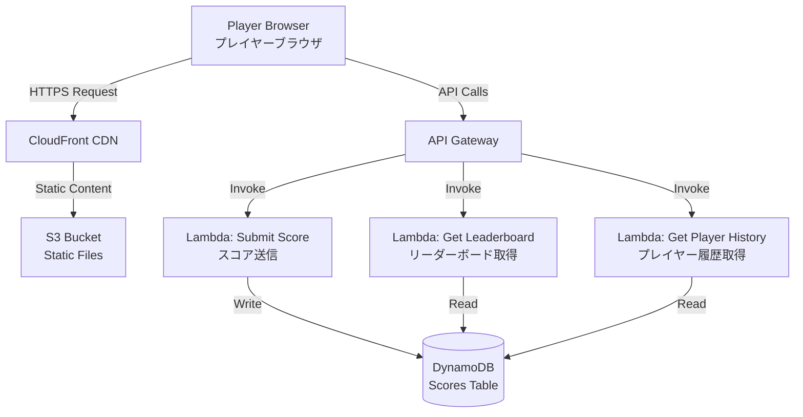
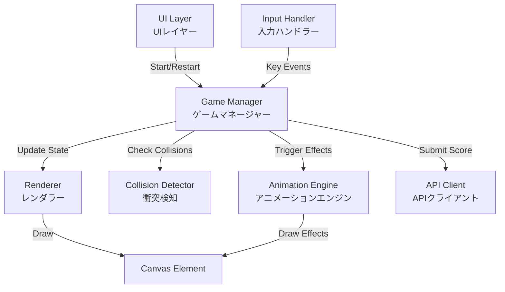
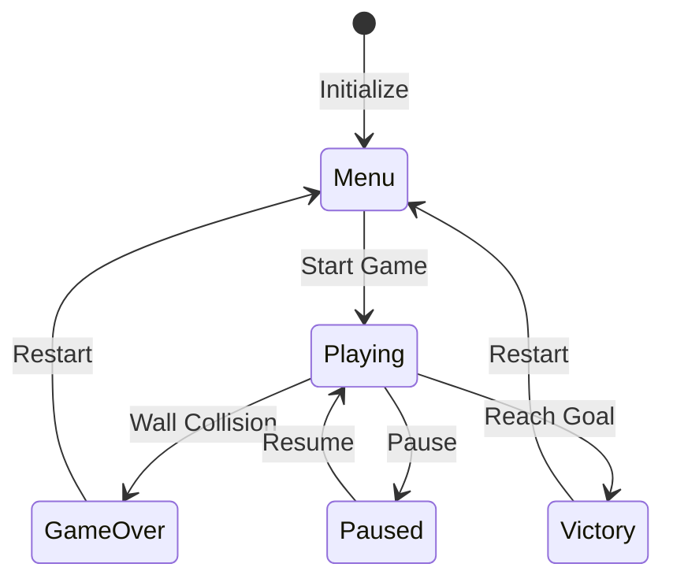

# Design Document（設計ドキュメント）

## Overview（概要）

キーボード矢印キーで操作するイライラ棒ゲームのWebアプリケーション。プレイヤーはキャラクターを壁に触れないように操作しながらゴールを目指します。一度矢印キーを押すと、別のキーが押されるまでその方向に移動し続けるという独特の操作性により、高い難易度と緊張感を実現します。

### Technology Stack（技術スタック）

**Frontend（フロントエンド）:**
- HTML5 Canvas for game rendering（ゲーム描画）
- Vanilla JavaScript（ES6+）for game logic（ゲームロジック）
- CSS3 for UI styling（UIスタイリング）

**Backend（バックエンド）:**
- AWS Lambda（Node.js runtime）for serverless functions（サーバーレス関数）
- Amazon API Gateway for REST API（REST API）
- Amazon DynamoDB for data storage（データストレージ）

**Hosting & Delivery（ホスティング＆配信）:**
- Amazon S3 for static file hosting（静的ファイルホスティング）
- Amazon CloudFront for CDN（CDN）

## Architecture（アーキテクチャ）

### System Architecture Diagram（システムアーキテクチャ図）



### Frontend Architecture（フロントエンドアーキテクチャ）



## Components and Interfaces（コンポーネントとインターフェース）

### 1. Game Manager（ゲームマネージャー）

ゲーム全体の状態管理とゲームループを制御する中核コンポーネント。

**Responsibilities（責務）:**
- Game state management（ゲーム状態管理）
- Game loop execution（ゲームループ実行）
- Coordinate between components（コンポーネント間の調整）
- Timer management（タイマー管理）

**Interface:**
```javascript
class GameManager {
  constructor(canvas, difficulty)
  startGame()
  pauseGame()
  restartGame()
  update(deltaTime)
  handleGameOver()
  handleGoalReached()
  getCurrentState()
}
```

**State Machine（状態機械）:**


### 2. Input Handler（入力ハンドラー）

キーボード入力を処理し、ゲームマネージャーに方向変更を通知。

**Responsibilities:**
- Capture keyboard events（キーボードイベントのキャプチャ）
- Validate input during gameplay（ゲームプレイ中の入力検証）
- Prevent input during animations（アニメーション中の入力防止）

**Interface:**
```javascript
class InputHandler {
  constructor(gameManager)
  enable()
  disable()
  handleKeyDown(event)
  getCurrentDirection()
}
```

### 3. Character（キャラクター）

プレイヤーが操作するゲーム内のキャラクター。

**Responsibilities:**
- Position tracking（位置追跡）
- Movement calculation（移動計算）
- Collision boundary management（衝突境界管理）

**Interface:**
```javascript
class Character {
  constructor(x, y, size)
  setDirection(direction)
  update(speed)
  getPosition()
  getBounds()
  reset(x, y)
}
```

### 4. Level Generator（レベルジェネレーター）

難易度に応じたゲームレベル（通路と壁）を生成。

**Responsibilities:**
- Generate path layout（通路レイアウトの生成）
- Create walls based on difficulty（難易度に基づく壁の作成）
- Define start and goal positions（スタートとゴール位置の定義）

**Interface:**
```javascript
class LevelGenerator {
  constructor(width, height, difficulty)
  generate()
  getWalls()
  getStartPosition()
  getGoalPosition()
  getPathWidth()
}
```

**Level Generation Algorithm（レベル生成アルゴリズム）:**
1. Define start point at left edge（左端にスタート地点を定義）
2. Generate random waypoints across canvas（キャンバス全体にランダムなウェイポイントを生成）
3. Connect waypoints with curved paths（ウェイポイントを曲線で接続）
4. Create walls along path boundaries（通路境界に沿って壁を作成）
5. Place goal at final waypoint（最終ウェイポイントにゴールを配置）

### 5. Collision Detector（衝突検知器）

キャラクターと壁、ゴールとの衝突を検知。

**Responsibilities:**
- Check character-wall collisions（キャラクターと壁の衝突チェック）
- Check character-goal collisions（キャラクターとゴールの衝突チェック）
- Provide collision point information（衝突地点情報の提供）

**Interface:**
```javascript
class CollisionDetector {
  constructor(character, walls, goal)
  checkWallCollision()
  checkGoalCollision()
  getCollisionPoint()
}
```

**Collision Detection Method（衝突検知方法）:**
- Use bounding box collision for performance（パフォーマンスのためバウンディングボックス衝突を使用）
- Check at 60 FPS for accuracy（精度のため60FPSでチェック）

### 6. Renderer（レンダラー）

Canvas上にゲーム要素を描画。

**Responsibilities:**
- Draw game elements（ゲーム要素の描画）
- Update display at 60 FPS（60FPSで表示更新）
- Render UI elements（UI要素のレンダリング）

**Interface:**
```javascript
class Renderer {
  constructor(canvas)
  clear()
  drawWalls(walls)
  drawPath(path)
  drawCharacter(character)
  drawGoal(goal)
  drawTimer(time)
  drawUI(state)
}
```

### 7. Animation Engine（アニメーションエンジン）

ゲームオーバーとクリア時のアニメーションを管理。

**Responsibilities:**
- Play collision animations（衝突アニメーションの再生）
- Play victory animations（勝利アニメーションの再生）
- Manage animation timing（アニメーションタイミングの管理）

**Interface:**
```javascript
class AnimationEngine {
  constructor(canvas)
  playExplosion(x, y, callback)
  playVictory(x, y, callback)
  update(deltaTime)
  isPlaying()
}
```

**Animation Types（アニメーションタイプ）:**
- **Explosion**: Particle burst effect at collision point（衝突地点でのパーティクルバーストエフェクト）
- **Victory**: Confetti/fireworks from goal position（ゴール位置からの紙吹雪/花火）

### 8. API Client（APIクライアント）

バックエンドAPIとの通信を管理。

**Responsibilities:**
- Submit scores（スコア送信）
- Fetch leaderboard（リーダーボード取得）
- Fetch player history（プレイヤー履歴取得）
- Handle API errors（APIエラー処理）

**Interface:**
```javascript
class APIClient {
  constructor(apiEndpoint)
  async submitScore(playerName, score, difficulty)
  async getLeaderboard(difficulty, limit)
  async getPlayerHistory(playerName)
}
```

### 9. Lambda Functions（Lambda関数）

#### Submit Score Function（スコア送信関数）
```javascript
// POST /scores
{
  playerName: string,
  score: number,
  difficulty: string,
  timestamp: number
}
```

#### Get Leaderboard Function（リーダーボード取得関数）
```javascript
// GET /leaderboard?difficulty={difficulty}&limit={limit}
Response: [
  {
    playerName: string,
    score: number,
    difficulty: string,
    timestamp: number
  }
]
```

#### Get Player History Function（プレイヤー履歴取得関数）
```javascript
// GET /history?playerName={playerName}
Response: [
  {
    score: number,
    difficulty: string,
    timestamp: number
  }
]
```

## Data Models（データモデル）

### DynamoDB Table: Scores（スコアテーブル）

**Table Name:** `wire-game-scores`

**Primary Key:**
- Partition Key: `difficulty` (String) - "easy", "medium", "hard", "super-hard"
- Sort Key: `timestamp` (Number) - Unix timestamp in milliseconds

**Attributes:**
- `playerName` (String) - Sanitized player name
- `score` (Number) - Completion time in milliseconds
- `difficulty` (String) - Difficulty level
- `timestamp` (Number) - When the score was achieved

**Global Secondary Index: PlayerIndex**
- Partition Key: `playerName` (String)
- Sort Key: `timestamp` (Number)

**Access Patterns:**
1. Get top scores by difficulty: Query by `difficulty`, sort by `score` ASC
2. Get player history: Query PlayerIndex by `playerName`

### Frontend Data Structures（フロントエンドデータ構造）

#### Game State（ゲーム状態）
```javascript
{
  status: 'menu' | 'playing' | 'paused' | 'gameover' | 'victory',
  difficulty: 'easy' | 'medium' | 'hard' | 'super-hard',
  score: number,
  startTime: number,
  character: Character,
  level: Level,
  currentDirection: 'up' | 'down' | 'left' | 'right'
}
```

#### Level Data（レベルデータ）
```javascript
{
  walls: Array<{x: number, y: number, width: number, height: number}>,
  path: Array<{x: number, y: number}>,
  startPosition: {x: number, y: number},
  goalPosition: {x: number, y: number},
  pathWidth: number,
  characterSpeed: number
}
```

#### Character Data（キャラクターデータ）
```javascript
{
  x: number,
  y: number,
  size: number,
  direction: 'up' | 'down' | 'left' | 'right',
  speed: number
}
```

## Correctness Properties（正確性プロパティ）

*A property is a characteristic or behavior that should hold true across all valid executions of a system-essentially, a formal statement about what the system should do. Properties serve as the bridge between human-readable specifications and machine-verifiable correctness guarantees.*


### Property 1: Direction Change Correspondence（方向変更の対応）
*For any* arrow key press during gameplay, the character's movement direction should immediately change to match the pressed key's direction (up/down/left/right).
**Validates: Requirements 1.1**

### Property 2: Continuous Movement Persistence（連続移動の持続）
*For any* set direction, the character should continue moving in that direction at constant speed across multiple game updates until a different arrow key is pressed.
**Validates: Requirements 1.2**

### Property 3: Direction Change Without Stop（停止なしの方向変更）
*For any* direction change, the character's speed should remain constant before and after the change, with only the direction vector changing.
**Validates: Requirements 1.4**

### Property 4: Input Gating by Game State（ゲーム状態による入力制御）
*For any* arrow key press when the game state is not 'playing', the character's position and direction should remain unchanged.
**Validates: Requirements 1.5**

### Property 5: Collision Triggers Game Over（衝突によるゲームオーバー）
*For any* character position that intersects with a wall boundary, the game state should transition to 'gameover'.
**Validates: Requirements 2.1**

### Property 6: Timer Stops on Game Over（ゲームオーバー時のタイマー停止）
*For any* game state transition to 'gameover', subsequent game updates should not increment the timer value.
**Validates: Requirements 2.2**

### Property 7: Safe Path Allows Continuation（安全通路での継続）
*For any* character position within the safe path boundaries (not intersecting walls), the game state should remain 'playing' (not transition to 'gameover').
**Validates: Requirements 2.4**

### Property 8: Timer Monotonic Increase（タイマーの単調増加）
*For any* sequence of game updates while in 'playing' state, the timer value should increase monotonically (never decrease).
**Validates: Requirements 3.2**

### Property 9: Score Equals Completion Time（スコアは完了時間と等しい）
*For any* game completion (reaching goal), the recorded score should equal the timer value at the moment of goal collision.
**Validates: Requirements 3.3**

### Property 10: Restart Resets State（再スタートによる状態リセット）
*For any* game state, calling restart should reset timer to 0, character position to start position, and game state to initial state.
**Validates: Requirements 4.3**

### Property 11: Difficulty Determines Level Properties（難易度がレベル特性を決定）
*For any* difficulty level selection, the generated level should have path width and character speed matching the specifications for that difficulty (easy: 100px/2px, medium: 60px/3px, hard: 40px/4px, super-hard: 30px/6px).
**Validates: Requirements 5.1, 5.2, 5.3, 5.4, 5.5**

### Property 12: Score Submission on Completion（完了時のスコア送信）
*For any* game completion with valid player name, the API client's submitScore method should be called with the player name, final score, and difficulty level.
**Validates: Requirements 6.1**

### Property 13: Score Storage with Timestamp（タイムスタンプ付きスコア保存）
*For any* score submission received by the backend, the DynamoDB table should contain an entry with the score, player name, difficulty, and a timestamp.
**Validates: Requirements 6.2**

### Property 14: Score Includes Difficulty（スコアに難易度を含む）
*For any* score stored in the database, the entry should include the difficulty level field matching the difficulty played.
**Validates: Requirements 6.3**

### Property 15: Player History Chronological Order（プレイヤー履歴の時系列順）
*For any* player name query, the returned score history should be sorted in chronological order by timestamp (oldest to newest or newest to oldest consistently).
**Validates: Requirements 6.4**

### Property 16: Leaderboard Top Scores（リーダーボードのトップスコア）
*For any* difficulty level, the leaderboard query should return at most 10 scores, and these should be the lowest score values (best times) for that difficulty.
**Validates: Requirements 7.1**

### Property 17: Name Length Validation（名前の長さ検証）
*For any* input string, the name validation should accept strings with length between 1 and 20 characters (inclusive) and reject all others.
**Validates: Requirements 8.2**

### Property 18: Name Sanitization（名前のサニタイゼーション）
*For any* input string, the sanitized output should contain only alphanumeric characters, spaces, hyphens, and underscores, with all other characters removed or rejected.
**Validates: Requirements 8.3**

### Property 19: Backend Name Validation（バックエンドの名前検証）
*For any* name received by the backend Lambda function, the name should be validated and sanitized before being stored in DynamoDB.
**Validates: Requirements 8.4**

### Property 20: Valid Name Included in Submission（有効な名前を送信に含む）
*For any* valid player name (passing validation), the score submission API call should include that exact name in the request payload.
**Validates: Requirements 8.6**

### Property 21: Collision Triggers Animation（衝突によるアニメーション起動）
*For any* wall collision event, the animation engine's playExplosion method should be called with the collision point coordinates.
**Validates: Requirements 11.1**

### Property 22: Game Over Animation Duration（ゲームオーバーアニメーション時間）
*For any* game over animation, the animation should play for a duration between 1000 and 2000 milliseconds before transitioning to the results screen.
**Validates: Requirements 11.2**

### Property 23: Goal Triggers Victory Animation（ゴールによる勝利アニメーション）
*For any* goal collision event, the animation engine's playVictory method should be called with the goal position coordinates.
**Validates: Requirements 11.3**

### Property 24: Victory Animation Duration（勝利アニメーション時間）
*For any* victory animation, the animation should play for a duration between 2000 and 3000 milliseconds before showing the score submission screen.
**Validates: Requirements 11.4**

### Property 25: Input Blocked During Animation（アニメーション中の入力ブロック）
*For any* time period while an animation is playing (isPlaying() returns true), arrow key inputs should be ignored and not affect character movement or direction.
**Validates: Requirements 11.5**

## Error Handling（エラー処理）

### Frontend Error Handling（フロントエンドエラー処理）

**Input Validation Errors:**
- Invalid player name → Display error message, allow re-entry
- Empty name → Display "Name is required" message
- Name too long → Display "Name must be 20 characters or less"
- Invalid characters → Display "Name can only contain letters, numbers, spaces, hyphens, and underscores"

**API Communication Errors:**
- Network failure → Display "Unable to submit score. Please check your connection."
- API timeout → Display "Request timed out. Please try again."
- Server error (5xx) → Display "Server error. Your score was not saved."
- Rate limiting (429) → Display "Too many requests. Please wait a moment."

**Game Logic Errors:**
- Invalid game state transition → Log error, reset to menu state
- Collision detection failure → Log error, continue game (fail-safe)
- Animation error → Log error, skip animation, continue to next state

### Backend Error Handling（バックエンドエラー処理）

**Lambda Function Error Handling:**

```javascript
// Error response format
{
  statusCode: number,
  body: JSON.stringify({
    error: string,
    message: string
  })
}
```

**Error Types:**

1. **Validation Errors (400 Bad Request):**
   - Missing required fields
   - Invalid data types
   - Name validation failure
   - Score out of valid range

2. **DynamoDB Errors:**
   - Write failure → Retry up to 3 times with exponential backoff
   - Read failure → Return cached data if available, otherwise error
   - Throttling → Implement exponential backoff

3. **Internal Errors (500 Internal Server Error):**
   - Unexpected exceptions → Log to CloudWatch, return generic error
   - Timeout → Return timeout error after 29 seconds (Lambda limit)

**Input Sanitization:**
```javascript
function sanitizeName(name) {
  // Remove all characters except alphanumeric, space, hyphen, underscore
  const sanitized = name.replace(/[^a-zA-Z0-9 \-_]/g, '');
  
  // Trim whitespace
  const trimmed = sanitized.trim();
  
  // Validate length
  if (trimmed.length < 1 || trimmed.length > 20) {
    throw new ValidationError('Name must be 1-20 characters');
  }
  
  return trimmed;
}
```

## Testing Strategy（テスト戦略）

### Unit Testing（ユニットテスト）

**Framework:** Jest for JavaScript

**Test Coverage Areas:**
- Character movement logic
- Collision detection algorithms
- Input handling and validation
- Game state transitions
- API client request formatting
- Lambda function business logic
- Name sanitization functions

**Example Unit Tests:**
```javascript
describe('Character', () => {
  test('should initialize at correct position', () => {
    const char = new Character(100, 100, 10);
    expect(char.getPosition()).toEqual({x: 100, y: 100});
  });
  
  test('should move in set direction', () => {
    const char = new Character(100, 100, 10);
    char.setDirection('right');
    char.update(5);
    expect(char.getPosition().x).toBe(105);
  });
});

describe('Name Sanitization', () => {
  test('should remove special characters', () => {
    expect(sanitizeName('Player<script>')).toBe('Playerscript');
  });
  
  test('should reject empty names', () => {
    expect(() => sanitizeName('')).toThrow();
  });
});
```

### Property-Based Testing（プロパティベーステスト）

**Framework:** fast-check for JavaScript

Property-based testing will verify that the correctness properties defined above hold across a wide range of randomly generated inputs. Each property test will run a minimum of 100 iterations with different random inputs.

**Test Configuration:**
```javascript
import fc from 'fast-check';

// Configure to run 100 iterations per property
const config = { numRuns: 100 };
```

**Property Test Examples:**

```javascript
describe('Property Tests', () => {
  test('Property 1: Direction Change Correspondence', () => {
    fc.assert(
      fc.property(
        fc.constantFrom('up', 'down', 'left', 'right'),
        (direction) => {
          const game = new GameManager(canvas, 'easy');
          game.startGame();
          game.inputHandler.handleKeyDown({key: `Arrow${capitalize(direction)}`});
          expect(game.character.direction).toBe(direction);
        }
      ),
      config
    );
  });
  
  test('Property 18: Name Sanitization', () => {
    fc.assert(
      fc.property(
        fc.string(),
        (input) => {
          try {
            const sanitized = sanitizeName(input);
            // Verify only allowed characters remain
            expect(sanitized).toMatch(/^[a-zA-Z0-9 \-_]+$/);
          } catch (e) {
            // If validation fails, that's also acceptable
            expect(e).toBeInstanceOf(ValidationError);
          }
        }
      ),
      config
    );
  });
});
```

**Property Test Tagging:**
Each property-based test will include a comment explicitly referencing the correctness property from this design document:
```javascript
// Feature: mouse-wire-game, Property 1: Direction Change Correspondence
```

### Integration Testing（統合テスト）

**Areas to Test:**
- Frontend to API Gateway communication
- Lambda to DynamoDB operations
- End-to-end score submission flow
- Leaderboard retrieval flow

**Tools:**
- AWS SAM Local for local Lambda testing
- DynamoDB Local for database testing
- Supertest for API endpoint testing

### Manual Testing（手動テスト）

**Test Scenarios:**
1. Play through each difficulty level
2. Verify animations play correctly
3. Test leaderboard display
4. Verify responsive controls
5. Test on different browsers (Chrome, Firefox, Safari, Edge)
6. Test on different screen sizes

## Deployment Architecture（デプロイアーキテクチャ）

### Infrastructure as Code（コードとしてのインフラ）

**Tool:** AWS SAM (Serverless Application Model) or AWS CDK

**Resources to Deploy:**

1. **S3 Bucket** - Static website hosting
   - Enable static website hosting
   - Configure CORS for API calls
   - Set bucket policy for public read access

2. **CloudFront Distribution**
   - Origin: S3 bucket
   - Enable HTTPS
   - Configure caching policies
   - Set custom error pages

3. **API Gateway**
   - REST API
   - CORS enabled
   - Request validation
   - Rate limiting (1000 requests per minute per IP)

4. **Lambda Functions** (3 functions)
   - Runtime: Node.js 18.x
   - Memory: 256 MB
   - Timeout: 30 seconds
   - Environment variables: DynamoDB table name

5. **DynamoDB Table**
   - On-demand billing mode
   - Point-in-time recovery enabled
   - Encryption at rest
   - Global Secondary Index for player queries

6. **IAM Roles**
   - Lambda execution role with DynamoDB permissions
   - CloudFront OAI for S3 access

### Deployment Process（デプロイプロセス）

1. **Build Frontend:**
   ```bash
   npm run build
   ```

2. **Deploy Backend:**
   ```bash
   sam build
   sam deploy --guided
   ```

3. **Upload Frontend to S3:**
   ```bash
   aws s3 sync ./dist s3://bucket-name --delete
   ```

4. **Invalidate CloudFront Cache:**
   ```bash
   aws cloudfront create-invalidation --distribution-id ID --paths "/*"
   ```

### Environment Configuration（環境設定）

**Frontend Environment Variables:**
```javascript
// config.js
export const API_ENDPOINT = process.env.API_ENDPOINT || 'https://api.example.com';
```

**Backend Environment Variables:**
```yaml
Environment:
  Variables:
    TABLE_NAME: wire-game-scores
    CORS_ORIGIN: https://yourdomain.com
```

## Performance Considerations（パフォーマンスの考慮事項）

### Frontend Performance（フロントエンドパフォーマンス）

**Target Metrics:**
- 60 FPS gameplay
- < 100ms input latency
- < 2s initial page load

**Optimization Strategies:**
- Use requestAnimationFrame for game loop
- Minimize DOM manipulations during gameplay
- Use Canvas for all game rendering
- Implement object pooling for particles
- Lazy load leaderboard data

### Backend Performance（バックエンドパフォーマンス）

**Target Metrics:**
- < 200ms API response time (p95)
- < 1s cold start time
- Support 100 concurrent users

**Optimization Strategies:**
- Use DynamoDB single-table design
- Implement efficient query patterns with GSI
- Enable Lambda provisioned concurrency for production
- Use API Gateway caching for leaderboard
- Implement connection pooling (if using RDS in future)

### DynamoDB Optimization（DynamoDB最適化）

**Access Patterns:**
1. Write score: PutItem on primary key
2. Get leaderboard: Query by difficulty, sort by score
3. Get player history: Query GSI by playerName

**Capacity Planning:**
- On-demand mode for variable traffic
- Monitor for hot partitions
- Use composite sort keys for efficient queries

## Security Considerations（セキュリティの考慮事項）

### Frontend Security（フロントエンドセキュリティ）

1. **Input Validation:**
   - Sanitize all user inputs
   - Validate data types and ranges
   - Prevent XSS attacks

2. **API Communication:**
   - Use HTTPS only
   - Implement request signing (optional)
   - Rate limiting on client side

3. **Content Security Policy:**
   ```html
   <meta http-equiv="Content-Security-Policy" 
         content="default-src 'self'; 
                  script-src 'self'; 
                  style-src 'self' 'unsafe-inline'; 
                  connect-src 'self' https://api.example.com">
   ```

### Backend Security（バックエンドセキュリティ）

1. **API Gateway:**
   - Enable AWS WAF
   - Configure rate limiting
   - Implement request validation
   - Enable CloudWatch logging

2. **Lambda Functions:**
   - Principle of least privilege for IAM roles
   - Input validation and sanitization
   - Error message sanitization (don't leak internal details)
   - Enable X-Ray tracing

3. **DynamoDB:**
   - Encryption at rest
   - Encryption in transit
   - Fine-grained access control
   - Enable point-in-time recovery

4. **Injection Prevention:**
   - Sanitize all inputs on both frontend and backend
   - Use parameterized queries (DynamoDB SDK handles this)
   - Validate data types
   - Implement allowlist for player names

### CORS Configuration（CORS設定）

```javascript
// API Gateway CORS headers
{
  'Access-Control-Allow-Origin': 'https://yourdomain.com',
  'Access-Control-Allow-Methods': 'GET,POST,OPTIONS',
  'Access-Control-Allow-Headers': 'Content-Type',
  'Access-Control-Max-Age': '3600'
}
```

## Monitoring and Logging（監視とログ記録）

### CloudWatch Metrics（CloudWatchメトリクス）

**Lambda Metrics:**
- Invocation count
- Error count
- Duration
- Throttles
- Cold starts

**API Gateway Metrics:**
- Request count
- 4xx/5xx errors
- Latency
- Cache hit/miss ratio

**DynamoDB Metrics:**
- Read/write capacity units
- Throttled requests
- System errors

**Custom Metrics:**
- Games played per difficulty
- Average completion time
- Game over rate
- Score submission success rate

### Logging Strategy（ログ戦略）

**Frontend Logging:**
```javascript
// Log critical errors to backend
function logError(error, context) {
  console.error(error);
  // Optionally send to logging service
  fetch('/api/log', {
    method: 'POST',
    body: JSON.stringify({ error: error.message, context })
  });
}
```

**Backend Logging:**
```javascript
// Structured logging in Lambda
console.log(JSON.stringify({
  level: 'INFO',
  message: 'Score submitted',
  playerName: sanitizedName,
  score: score,
  difficulty: difficulty,
  timestamp: Date.now()
}));
```

### Alerting（アラート）

**CloudWatch Alarms:**
- Lambda error rate > 5%
- API Gateway 5xx rate > 1%
- DynamoDB throttling events
- High latency (p95 > 500ms)

## Future Enhancements（将来の拡張）

1. **Multiplayer Mode:**
   - Real-time racing against other players
   - WebSocket support via API Gateway
   - Shared leaderboard during race

2. **Level Editor:**
   - Allow players to create custom levels
   - Share levels with community
   - Vote on best levels

3. **Power-ups:**
   - Slow motion
   - Shield (one collision forgiveness)
   - Speed boost

4. **Achievements:**
   - Complete all difficulties
   - Speed run achievements
   - Consistency achievements

5. **Mobile Support:**
   - Touch controls
   - Responsive design
   - Progressive Web App (PWA)

6. **Social Features:**
   - Share scores on social media
   - Challenge friends
   - Global tournaments

7. **Analytics:**
   - Player behavior tracking
   - A/B testing for difficulty tuning
   - Heatmaps of collision points
